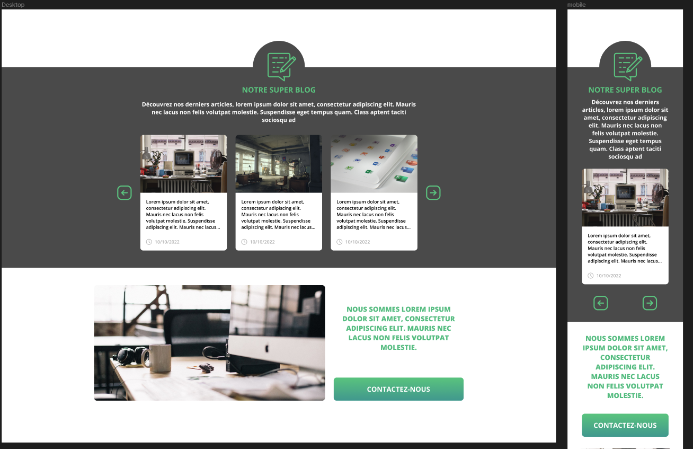

# Ma Super Agence

## 1 - Objectifs

Intégrer une [maquette](https://www.figma.com/file/Xayw7jyCa3v8U8XdTq4PCf/test---frontend?t=MzjXfEgkgckHrrsX-6) depuis Figma.

## 2 - Briefing

### 2.1 - Contraintes techniques

- [x] Utiliser Sass avec imbrication
- [x] Utiliser la librairie OwlCarousel
- [x] Utiliser CSS Flexbox

### 2.2 - Responsivité

- [x] Version desktop (maquette fournie)
- [x] Version tablette (maquette non fournie)
- [x] Version mobile (maquette fournie)
- [x] Container interne des sections : 1280px max en version desktop
- [x] Section "CTA" : image de 800px max en version desktop

### 2.3 - Animation CSS

- [x] Durée des transitions de 250ms

#### 2.3.1 - Animation des articles de blog

- [x] Scale de l'image au hover
- [x] Changement de couleur du texte au hover

#### 2.3.2 - Animation des boutons de navigation du slider

- [x] Changement de couleur des boutons

#### 2.3.3 - Animation du bouton Call-To-Action

- [x] Transition sur un dégradé linéaire (inversion du dégradé)

#### 2.4 - Comportement du carrousel

- [x] Présente 3 items en version desktop
- [x] Présente 2 items en version tablette
- [x] Présente 1 item en version mobile
- [x] Flèches de navigation personnalisées
- [x] Boutons de navigation latéraux en version tablette/desktop
- [x] Boutons de navigation sous le carrousel en version mobile

## 3 - Parti-pris techniques

### 3.1 - Librairies externes

- Utilisation de OwnCarousel et jQuery via CDN

### 3.2 - Structure HTML

- Une section placeholder vide a été ajoutée au début du document Elle permet de voir la transposition verticale de l'icône de la section Blog

### 3.3 - CSS

- Ajout d'une ombre sous les cartes d'articles de blog
- Ajout d'animations des éléments au scroll. Ces animations sont "en bonus" et peuvent être retirées simplement en commentant la ligne `addScrollAnimation()` dans index.js.
- Les icônes pour les timestamps des articles n'ayant pas de valeur sémantique, elles ont été intégrées sous forme de pseudo-éléments

Les breakpoints choisis sont les suivants :

- **Mobile :** &lt; 961px
- **Tablette :** 961px - 1280px
- **Desktop :** &gt; 1280px

### 3.4 - Carousel

- Ajout d'un 4e article pour permettre l'affichage des boutons de navigation de owlCarousel
- Création des versions tablette et mobile des photos
- Ajout de différents sourcesets pour les images

## 4 - Notes

- La taille de la police étant la même dans la maquette desktop et mobile, elles ont été conservées à l'implémentation (en px, pas en em)
